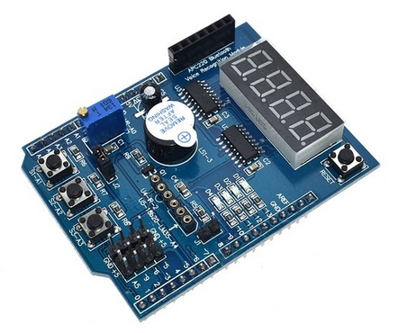
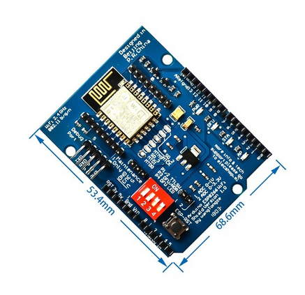

# multifunctionCayenne
making the Arduino multi-function board available on Cayenne
## Contents of this repository
The multi-function board features
* 3 user push buttons which can be read out
* 4 user LEDs
* a 4 digit 7-segemnt display
* a passive buzzer
* a potentiometer connected to the Arduino 10 bit ADC
* an optional LM35 analog thermometer
* an optional DS18B20 digital thermometer

The LM35 and the DS18B20 are exclusiv, only one of the two can be used at a time.
The repository consists of two parts: the *driver* part with programs testing hardware access to the above sensors and actuators and a *cayenne* part which implements a Cayenne client reading out the sensors and sending the results to myDevices Cayenne or it takes commands from Cayenne widgets and drives the corresponding actuators. 

## Hardware access tests
This part has programs showing how to drive the LEDs, how to read out the switches, how to drive the 7-segment displays and how to read out the potentiometer voltage.

The most tricky bit is the 7-segment display which needs a period update of its digits every ~ 25 ms in order to produce a steady display. This is accomplished using a timer triggering an interrupt service routine every 8 ms which refreshes one digit at a time.
## The Cayenne Client
The Cayenne client builds on the experience gained with the hardware tests. It uses an ESP12 based WiFi shield to communicate with the Internet. This shield is installed on an Arduino Mega and on top of it the mult-function board is placed building a 3 board sandwich. Trying to run the Cayenne client on an Arduino Uno failed because of too limited RAM resources on the board (only 2kBytes). The WiFi shield has several problems, one of which the fact that it communicates with its host processor using AT commands on the Rx0 and Tx0 lines, which are also used for uploading and flashing code and for the Arduino console. When the WiFi shield is in use flashing will not work and the console must be switched off.
When new code must be uploaded to the Arduino the Rx0 and Tx0 lines must disconnect from the WiFi shield, which can be done with the first 2 switches of the dip switch block.
The factury setting for the baudrate of the WiFi board is 115200 baud. This is ok, as long as the interrupt service routine updating the 7-segment display is not running. With the 7-segment update switched on the update of a digit takes too long and character coming from the WiFi board's serial connection are lost. This can be avoided slowing down the communication speed to 9600 baud, which is fast enough for the few data exchanged.

## The Cayenne GUI

* The *State of Switches* widget shows the current state of the switches as a 3 bit binary number. "0" means all switches are off, "7" means all switches are pressed.
* The LEDs slider can deliver a 4 bit number (0..15) and lights the user LEDs on the multi function board. The value "0" will switch all LEDs off, "15" = "0xf" will switch them all on.
* The potentiometer gauge shows the voltage on the potentiometer in mV.
* The sevenSegment slider produces values from -1 to 65535 (0xffff) which are displayed on the 7-segment display if the Float/Hex button is in off position. If the value is -1 the display is switched off. 

When you set the Float/Hex button to "on" the voltage on the potentiometer in V is shown on the 7-segment display instead. 
